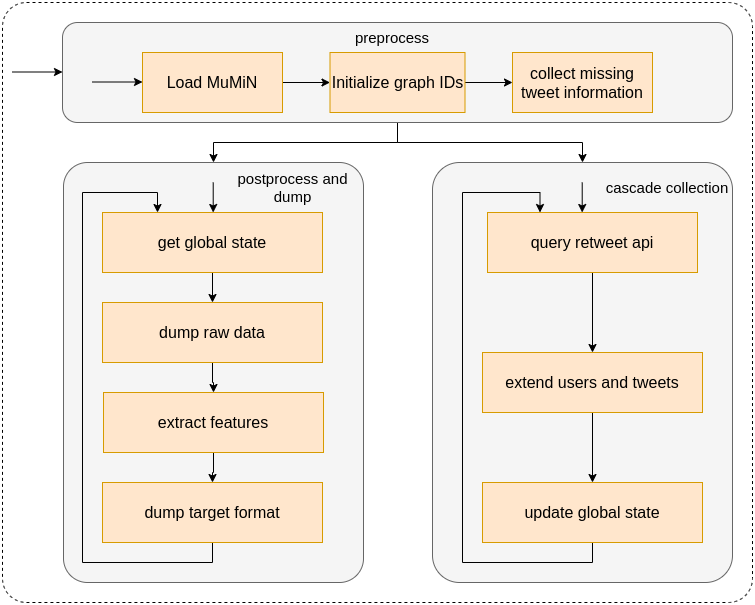

# Crawler

The crawler is responsible for creating a new data set starting from a list of
root tweets including cascade building and feature extraction. It consists of
the three components 'preprocess', 'cascade collection', and 'postprocess and dump'.
Here's an overview:

## Preprocess

Preprocess is the first stage of the crawler. It loads the root tweets which currently
come from the MuMiN data set. Along with the root tweets it also loads information
about whether they correspond to fake or true news and which of the root tweets belong
to the same graph. The MuMiN data set (and most likely other data sets, too) does not
contain all information about tweets and the respective users that we need. The last
step of preprocess fetches this information and removes any tweets from the list for
which fetching this information is not possible. Finally, we start the cascade
collection in one thread and postprocessing and dumping in another.

## Cascade Collection

The cascade collection goes over all tweets of all graphs and fetches their retweets.
We first query Twitter's Retweet API, then append the tweets to our list of tweets
and any new user to the list of users. Since we have only one list of tweets and we
append to the end of this list, this crawling corresponds to BFS. Finally, the
thread notifies the postprocess thread of the changes.

The communication between these two threads is based on a set of shared state combined
with a semaphore. The shared state consists of the tweet list, the user list, the index
of the last processed tweet and user, and the index of the last tweet-retweet relation.

## Postprocess and Dump

The task of this thread is to periodically output a ready-to-use data set with all
necessary features. It does so in four steps.

1.  Retrieve global state (synchronized using the semaphore)
2.  Dump raw data:
    *   We write the complete internal data structures to files in case we want to
        analyze them later.
    *   They are stored as pickle files with indizes.
3. Extract features: We extract 4 types of features
    *   spacy: word embedding of the tweet text using the pretrained spacy model.
        This needs to be changed to the correct UPFD features.
    *   bert: word embedding of the tweet text using the pretrained bert(clip) model.
        This, too, needs to be changed to the correct UPFD features.
    *   profile: 10 attributes extracted from the user profile, e.g., whether the
        account is verified.
    *   content: concatenation of spacy and profile.
4. Dump the final data set in the target format:
    *   The crawler automatically formats the data set in the way which the models
        expect. For the infos on the data set see [Dataset.md](Dataset.md)